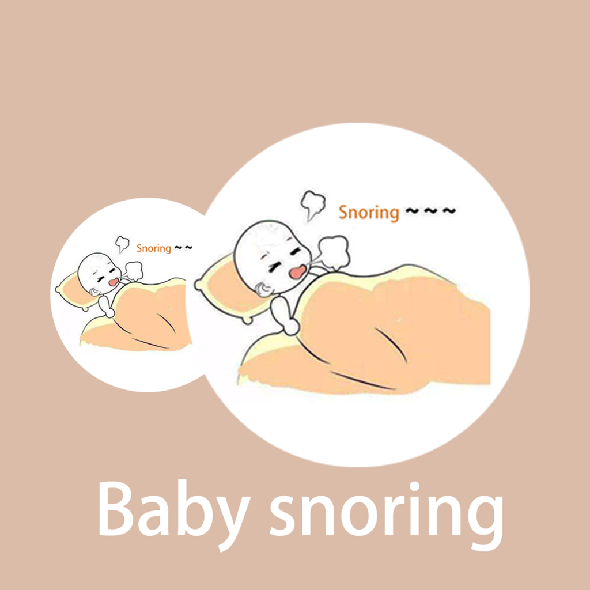

## Welcome to Baby Sleep Snore Record

Does your baby ever snore during sleep? Some babies snore loudly, others snore quietly. If your baby is experiencing this problem, you should pay more attention and take care of your baby. You can use the app to record how long your baby snores, how loud your baby snores, and where he snores. You can collect and record this information to help your baby stop snoring and grow healthily.

If you have any questions, you can either leave a message or send the questions to our email address.

We will answer them for you in the first time.

### Address: jichungan9498@163.com

Thank you!
